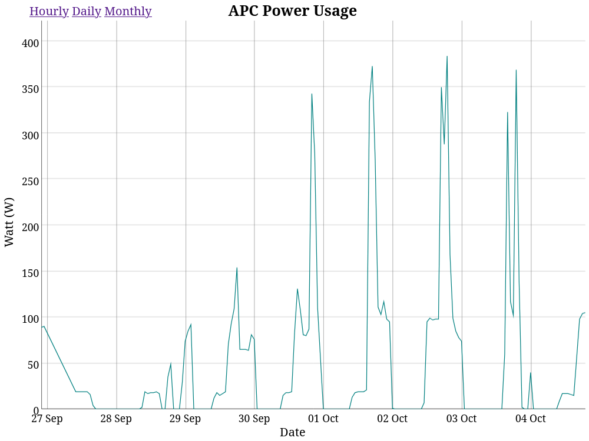

# APC Power Usage

## Introduction

APC Power Usage is an application which shows power consuption overtime for UPS units manufactured by <em>[APC.](https://www.apc.com)</em>

## Screenshoots

<p align="center">
    
</p>

## Getting Started

### Dependencies

* [python](https://www.python.org/)
* [apcupsd](http://www.apcupsd.org)

<em>Note: For more accurate data make sure to add `POLLTIME 1` to the apcupsd configuration file.</em>

### Installation

APC Power Usage comes as single python package.

```
python3 -m venv ~/.apc-power-usage/venv
~/.apc-power-usage/venv/bin/pip install APC-Power-Usage
```

### Executing program

```
~/.apc-power-usage/venv/bin/python -m apc
```

<em>APC Power Usage stores the data using SQLite. Located in `~/.apc-power-usage/main.db`.</em>

### Supported devices

- APC Back-UPS XS 950VA

## Help

Feel free to [report any issues](https://github.com/kondinskis/apc-power-usage/issues) you may have while using APC Power Usage.

## License

This project is licensed under the GPL-3.0 License - see the [LICENSE.md](https://github.com/kondinskis/apc-power-usage/blob/main/LICENSE.md) file for details

